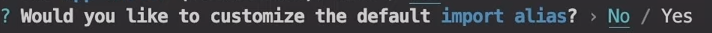

This is a [Next.js](https://nextjs.org/) project bootstrapped with [`create-next-app`](https://github.com/vercel/next.js/tree/canary/packages/create-next-app).

## Getting Started

First, run the development server:

```bash
npm run dev
# or
yarn dev
# or
pnpm dev
```

Open [http://localhost:3000](http://localhost:3000) with your browser to see the result.

You can start editing the page by modifying `app/page.tsx`. The page auto-updates as you edit the file.

This project uses [`next/font`](https://nextjs.org/docs/basic-features/font-optimization) to automatically optimize and load Inter, a custom Google Font.

## Learn More

To learn more about Next.js, take a look at the following resources:

- [Next.js Documentation](https://nextjs.org/docs) - learn about Next.js features and API.
- [Learn Next.js](https://nextjs.org/learn) - an interactive Next.js tutorial.

You can check out [the Next.js GitHub repository](https://github.com/vercel/next.js/) - your feedback and contributions are welcome!

## Deploy on Vercel

The easiest way to deploy your Next.js app is to use the [Vercel Platform](https://vercel.com/new?utm_medium=default-template&filter=next.js&utm_source=create-next-app&utm_campaign=create-next-app-readme) from the creators of Next.js.

Check out our [Next.js deployment documentation](https://nextjs.org/docs/deployment) for more details.
--------------------------------------------------------------------------------------------------
Admin Dashboard proyect:

1)shadcn/ui: esta libreria unos permite re-usar componentes usando Radix UI y Tailwind CSS, vamos a usar NEXTJS documentation.

NOTA: esto NO es una libreria de componentes. Es una coleccion de componentes re-usables que puedes copiar y pegar en nuestra app

instalacion de la libreria:
	npx create-next-app@latest ecommerce-admin --typescript --tailwind --eslint

luego de esto vamos a tener algunas opciones para elegir.

la primera opcion es : 


le damos y para aceptar.

la segunda opcion es:


le decimos que no,ya que esto puede cambiar algunas cosas de nuestro proyecto.

la tercera opcion es:


aqui escogemos la opcion yes, ya que Next 13 nos ofrece pages o AppRouter, pages es la forma
antigua de trabajar, vamos a usar la AppRouter.

la cuarta opcion es:



le vamos a decir que no por que vamos a hacer unos imports diferentes

y despues de esto solo esperamos a que se instale todo

1.2) instalaremos npx shadecn-ui@latest init
esto con el fin de poder configurar el json y nuestro proyecto

estas son las opciones que elegiremos:

Would you like to use TypeScript (recommended)? no / yes <=
Which style would you like to use? › Default <=
Which color would you like to use as base color? › Slate <=
Where is your global CSS file? › › app/globals.css <=
Do you want to use CSS variables for colors? › no / yes <=
Where is your tailwind.config.js located? › tailwind.config.js
Configure the import alias for components: › @/components <=
Configure the import alias for utils: › @/lib/utils
Are you using React Server Components? › no / yes <=
